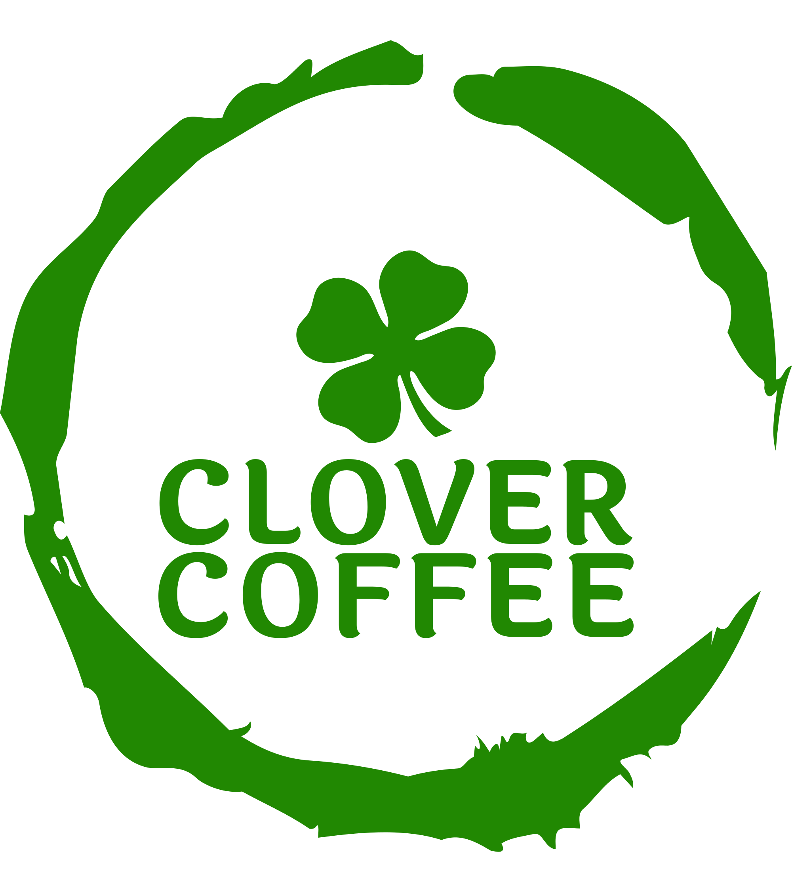

<a name="readme-top"></a>

<!-- PROJECT LOGO -->
<br />
<div align="center">
  <a href="https://github.com/github_username/repo_name">
    
  </a>

<h3 align="center">Clover Coffee</h3>

  <p align="center">
    Full Stack Application Built With React and Java/Springboot.
    <br />
    <a href="https://github.com/orgs/Clover-Coffee/repositories"><strong>Explore the docs »</strong></a>
    <br />
    <br />
    <a href="https://clover-coffee.vercel.app/">View Demo</a>
  </p>
</div>

### Built With

* [![Next][Next.js]][Next-url]
* [![React][React.js]][React-url]
* [![Bootstrap][Bootstrap.com]][Bootstrap-url]

<p align="right">(<a href="#readme-top">back to top</a>)</p>


<!-- GETTING STARTED -->
## Getting Started

* npm
  ```sh
  npm install
  npm run dev
  ```

[Next.js]: https://img.shields.io/badge/next.js-000000?style=for-the-badge&logo=nextdotjs&logoColor=white
[Next-url]: https://nextjs.org/
[React.js]: https://img.shields.io/badge/React-20232A?style=for-the-badge&logo=react&logoColor=61DAFB
[React-url]: https://reactjs.org/
[Bootstrap.com]: https://img.shields.io/badge/Bootstrap-563D7C?style=for-the-badge&logo=bootstrap&logoColor=white
[Bootstrap-url]: https://getbootstrap.com
